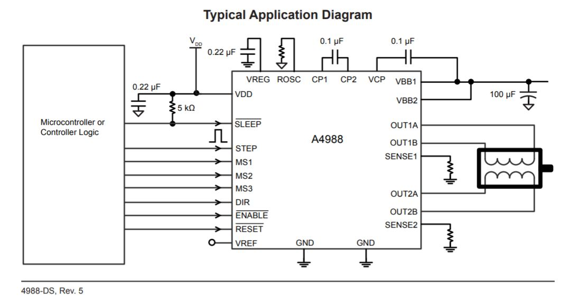

# 졸업프로젝트 하드웨어 설계

1. 부품 구성

   - Breadboard

   - JoyStick Shield V1
   - Arduino Mega 
   - 모터드라이브 L298N
   - [50cm 리니어레일 슬라이드 CNC 엑추에이터](http://scipia.com/product/500-%EB%A6%AC%EB%8B%88%EC%96%B4%EB%A0%88%EC%9D%BC-%EC%8A%AC%EB%9D%BC%EC%9D%B4%EB%93%9C-cnc%EC%97%91%EC%B6%94%EC%97%90%EC%9D%B4%ED%84%B0-%EC%95%84%EB%91%90%EC%9D%B4%EB%85%B8/906/category/153/display/1/)
     - NEMA17 4248 스텝모터 (42는 가로세로 in mili, 17은 가로세로 in inch)

     - 


### 1. 모터란?

1. #### [모터의 정의](https://www.rohm.co.kr/electronics-basics)

   모터란 전력 에너지를 받아 동력 에너지로 변환하는 전동기를 말한다. 

   모터를 구동 전원의 종류에 따라 분류하면 DC 모터와 AC 모터로 분류된다. 

   

2. #### 모터 회전 원리

   모터는 자석, 자력을 통해 회전한다. 

   회전축을 지닌 영구 자석의 주변에서 ① 자석을 회전시키면 (회전 자계), ② N극과 S극이 당겨지는 힘이나 같은 극끼리 밀어내는 힘에 의해 ③ 회전축을 지닌 자석이 회전합니다.
   이것이 모터 회전의 기초 원리이다. 

   


   실제로는 영구 자석 대신 도선에 전류를 주입시켜고 그 주변에 자계(자력)를 발생시켜 자석이 회전하는 것과 동일한 상태가 된다. 

   또한, 도선을 코일 상태로 말면, 자력의 합성을 통해 큰 자계의 다발 (자속)이 되어 N극과 S극이 발생한다. 코일 상태의 도선 속에 철심을 넣음으로써 자력선이 통과하기 쉽게 되어, 보다 강한 자력을 발생시킬 수 있다. 
   

3. #### 모터 회전 원리 (2)

   예를 들어 3상 교류와 코일을 사용하여 회전 자계를 만든다라고 생각을 할 때, 
   

   상기와 같이 철심에 코일을 감은 것을 3상의 U상 코일, V상 코일, W상 코일로 하고, 120° 시프트 배치함으로써 3상 전압이 높은 쪽의 코일에 N극, 낮은 쪽에 S극이 발생된다.
   각각의 상은 정현파 상태로 변화하므로, 각 코일에서 발생하는 극 (N극, S극)과 그 자계 (자력)이 변화된다. 이 때, N극이 발생하는 코일만을 보면, U상 코일 → V상 코일 → W상 코일 → U상 코일의 순서로 변화하므로, 회전할 수 있다.

   

4. #### [스텝 모터란](https://m.blog.naver.com/PostView.nhn?blogId=motor_bank&logNo=60176036396&proxyReferer=https:%2F%2Fwww.google.com%2F)

   스텝 모터 혹은 스테핑 모터는 전자 펄스를 기계적 운동으로 전환한다. 

   스테핑 모터 구동은 스테핑모터에 일정한 간격으로, 순간적으로 전류의 양을 변화시키는 펄스 형태의 입력전류(0~20mA)에 의하여 구동하는 모터이다. 

   

   구동 원리는 펄스가 입력될 때마다, 일정한 각도씩 모터가 회전하도록 제어(Control)가 된다. 이때 회전각을 스텝각(degree of step)이라고 한다.  스텝각을 작게하면, 모터 위치를 결정하는 정밀도를 향상시킬 수 있다. 

   또, 펄스 속도를 빠르게 하면 스테핑모터의 회전속도가 빨라진다. 

   

   스테핑모터의 구동 원리는 ①스테핑모터(Stepping motor)와 콘트롤러에서 받은 펄스 신호로 스테핑모터의 상을 여자해주는 ②스테핑모터 드라이버(Stepping Motor Drive) 그리고 펄스(Pluse)를 발생시켜 펄스를 드라이버에 전달하여 수행케 하는 ③컨트롤러이 세가지가 반드시 있어야 된다.

   

5. [라즈이노 iOT :: 【 아두이노 기초 】 #31 스텝(Step Motor)모터의 이해 (tistory.com)](https://rasino.tistory.com/149)


### 2. StepMoter 실습

1. **구성품** **(Includes) :**
   
   - 5V 스텝모터 x 1
   - ULN2003 모터드라이버 x 1
   
2. **사양** **(Specifications) :**

   - 각도 및 속도 제어 가능
   - 64각 스텝모터
   - 작동 전압: 5V
   - 스텝당 각도 : 5.625
   - 토크: 34.3mN.m
   - 직류 저항: 200Ω ± 7 % (25C)
   - 케이블 길이 : 235 mm

3. **데이터 시트**

   - 28BYJ-48 
     
   - 회전 각도는 입력 펄스의 신호의 수에 비례한다.**(Step을 64만큼 해야 5.625도 -> 5.625 * 64 = 360도)**
   - 회전 속도는 입력 펄스 신호의 주파수에 비례한다. 
   - 현재 RED 단자가 common으로 연결되어 있어 코일이 2개가 있어도 4상처럼 사용할 수 있다. A,A-,B,B-
   - 근데 우리가 사용하는 step motor는 common이 없어서 A,B밖에 없다.

4. https://juahnpop.tistory.com/127

5. 1상 여자 (One Phase on Full Step)

   ```c
   #define motorPin1 2 // IN1
   #define motorPin2 3 // IN2
   #define motorPin3 4 // IN3
   #define motorPin4 5 // IN4
    
   #define step 2048 // 1봐퀴 스텝수
    
   // 모터 회전 Loop 문 구현을 간단하게 하기위해 핀 배열 선언
   int pinArray[4] = { motorPin1, motorPin2, motorPin3, motorPin4 };
   // CW 시계방향 데이터 전송
   int CW[4] = {
                   0b1000,
                   0b0100,
                   0b0010,
                   0b0001
               };
    
   int CCW[4] = {
                   0b0001,
                   0b0010,
                   0b0100,
                   0b1000
               };
    
   void setup(){
       // 스텝모터 드라이브 보드의 IN 연결핀 출력으로 설정
       for(int i = 0 ; i < 4 ; i++ ) pinMode(pinArray[i], OUTPUT);
   }
    
   void loop(){
       // CW방향 1바퀴 후, CCW 1바퀴 
       int temp;
       for(int i = 0 ; i < step ; i++)
       {
           temp = i % 4;
           digitalWrite(pinArray[0], bitRead(CW[temp], 0));
           digitalWrite(pinArray[1], bitRead(CW[temp], 1));
           digitalWrite(pinArray[2], bitRead(CW[temp], 2));
           digitalWrite(pinArray[3], bitRead(CW[temp], 3));
           delay(3 );
       }
       delay(1000);
    
       for(int i = 0 ; i < step ; i++)
       {
           temp = i % 4;
           digitalWrite(pinArray[0], bitRead(CCW[temp], 0));
           digitalWrite(pinArray[1], bitRead(CCW[temp], 1));
           digitalWrite(pinArray[2], bitRead(CCW[temp], 2));
           digitalWrite(pinArray[3], bitRead(CCW[temp], 3));
           delay(3);
       }
       delay(1000);
   }
   ```

6. 2상 여자 (Two Phase on Full Step)

   ```c
   #define motorPin1 2 // IN1
   #define motorPin2 3 // IN2
   #define motorPin3 4 // IN3
   #define motorPin4 5 // IN4
    
   #define step 2048 // 1바퀴 스텝수
    
   // 모터 회전 Loop 문 구현을 간단하게 하기위해 핀 배열 선언
   int pinArray[4] = { motorPin1, motorPin2, motorPin3, motorPin4 };
   // CW 시계방향 데이터 전송
   int CW[4] = {
                   0b1100,
                   0b0110,
                   0b0011,
                   0b1001
               };
    
   int CCW[4] = {
                   0b1001,
                   0b0011,
                   0b0110,
                   0b1100
               };
    
   void setup(){
       // 스텝모터 드라이브 보드의 IN 연결핀 출력으로 설정
       for(int i = 0 ; i < 4 ; i++ ) pinMode(pinArray[i], OUTPUT);
   }
    
   void loop(){
       // CW방향 1바퀴 후, CCW 1바퀴 
       int temp;
       for(int i = 0 ; i < step ; i++)
       {
           temp = i % 4;
           digitalWrite(pinArray[0], bitRead(CW[temp], 0));
           digitalWrite(pinArray[1], bitRead(CW[temp], 1));
           digitalWrite(pinArray[2], bitRead(CW[temp], 2));
           digitalWrite(pinArray[3], bitRead(CW[temp], 3));
           delay(2);
       }
       delay(1000);
    
       for(int i = 0 ; i < step ; i++)
       {
           temp = i % 4;
           digitalWrite(pinArray[0], bitRead(CCW[temp], 0));
           digitalWrite(pinArray[1], bitRead(CCW[temp], 1));
           digitalWrite(pinArray[2], bitRead(CCW[temp], 2));
           digitalWrite(pinArray[3], bitRead(CCW[temp], 3));
           delay(2);
       }
       delay(1000);
   }
   ```

   ### 결과

   1상여자(Full Step)

   - Steps / 1-Turn : 2048
   - Step 최소 간격 : 3ms

   2상여자(Full Step)

   - Steps / 1-Turn : 2048
   - Step 최소 간격 : 2ms

   1-2상여자(Half Step)

   - Steps / 1-Turn : 4096
   - Step 최소 간격 : 1ms


### 2.1 실습2

1. **구성품** **(Includes) :**
   - 17HS4401 5V 스텝모터 x 1
   - A4988 모터드라이버 x 1
   
2. 스텝모터와 모터드라이버 스펙

   - 스텝모터
     - Bi-Polar: A(Black), A-(Green), B(Red), B-(Blue)
     - Step Angle : 1.8º
     - Rated Current(A) : 1.7A
     - 
   - 모터드라이브
     - 
     - 
     - 

3. 실습

   ```c
   int dirPin = 3;
   int stepPin = 4;
   
   void setup(){
     pinMode(dirPin,OUTPUT);
     pinMode(stepPin,OUTPUT);
     digitalWrite(dirPin,HIGH);
   }
   
   void loop(){
     digitalWrite(stepPin,HIGH);
     delayMicroseconds(500);
     digitalWrite(stepPin,LOW);
     delay(2);                     //이 딜레이를 통해 제어.
   }   
   ```

   

4. 


### 50cm 리니어레일 슬라이드 CNC 엑추에이터 구동 

- 현재 StepMotor

노란색-파란색, 빨간색-초록색

### 